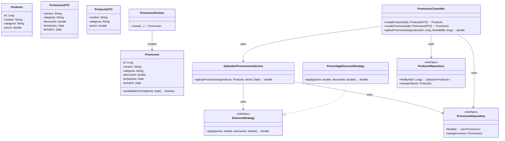

# Miércoles de locura

**Nivel:** Intermedio

## Descripción
Aplicar reglas de promociones basadas en fecha y controlar conflictos entre descuentos.

## Objetivo
Implementa una solución en Java que cumpla con la lógica descrita. Usa la plantilla en `src/com/walmarttech/Main.java` para comenzar.

## Cómo empezar
1. Clona este repositorio.
2. Dirígete a la carpeta `challenges-promo-rules`.
3. Abre `Main.java` y escribe tu solución.
4. ¡Comparte tu solución con la comunidad!
---
###Solución al Reto "Miércoles de Locura" - Reglas de Promoción

**Proyecto**: challenge-promo-rules  
**Rama**: feature/week-10-promo-rules  
**Autor**: xsoto-developer  
**Objetivo**: Implementar una solución híbrida que cumpla con el reto de reglas de promoción, demostrando habilidades avanzadas en Java y Spring Boot para el equipo técnico de Walmart-Tech-Mexico.

Este documento describe la solución desarrollada para el reto "Miércoles de Locura" (nivel intermedio) del repositorio [Walmart-Tech-Mexico/challenge-promo_rules](https://github.com/Walmart-Tech-Mexico/challenge-promo_rules.git). La solución incluye dos enfoques: una **versión básica** en Java puro que cumple estrictamente con las instrucciones del reto original, y una **versión avanzada** como microservicio Spring Boot que muestra prácticas modernas, patrones de diseño, principios SOLID, y herramientas como Swagger, H2, y JUnit 5. La implementación está diseñada para ser desacoplada, mantenible, y escalable, alineada con estándares de desarrollo profesional.

---

## Descripción del Reto
El reto consiste en implementar un sistema de reglas de promoción que aplique descuentos a productos según su categoría y validez temporal, resolviendo conflictos entre promociones (aplicando el descuento máximo). Los requisitos específicos son:
1. Implementar las clases `Promocion` y `Producto`.
2. Implementar la lógica en `AplicadorPromociones` para aplicar descuentos considerando categoría y fechas.
3. Resolver conflictos entre promociones (Ej. elegir el mayor descuento aplicable).
4. Crear casos de prueba para verificar la lógica.

---

## Enfoque de la Solución
La solución se desarrolló en dos versiones para cumplir con el reto y demostrar habilidades avanzadas:
- **Versión Básica (Java Puro)**: Implementación standalone en `Main.java`, sin dependencias externas, usando datos en memoria. Cumple estrictamente con las instrucciones originales para verificación rápida.
- **Versión Avanzada (Microservicio Spring Boot)**: Implementación como microservicio REST con persistencia en H2, documentación Swagger, pruebas unitarias, y arquitectura por capas, ideal para entornos empresariales.

### Patrones de Diseño Aplicados
- **Strategy**: Permite manejar diferentes tipos de descuentos (Ej., porcentaje) de forma extensible. La interfaz `DiscountStrategy` y su implementación `PercentageDiscountStrategy` encapsulan la lógica de aplicación de descuentos.
- **Factory**: Centraliza la creación de instancias de `Promocion` mediante `PromocionFactory`, facilitando la extensibilidad y mantenimiento.
- **Repository**: En el microservicio, abstrae el acceso a datos con `ProductoRepository` y `PromocionRepository` usando Spring Data JPA.

### Principios SOLID Aplicados
- **Single Responsibility Principle (SRP)**: Cada clase tiene una única responsabilidad (Ej., `Promocion` maneja datos de promoción, `AplicadorPromociones` aplica descuentos).
- **Open-Closed Principle (OCP)**: La lógica de descuentos es extensible mediante nuevas implementaciones de `DiscountStrategy` sin modificar código existente.
- **Dependency Inversion Principle (DIP)**: En el microservicio, las dependencias se inyectan (Ej., `DiscountStrategy` en `AplicadorPromocionesService`) usando Spring IoC.

---

## Estructura del Proyecto
La solución híbrida organiza el código en carpetas estándar para facilitar la revisión y mantenimiento.

### Versión Básica (Java Puro)
Ubicación: `challenges-promo-rules`
```
challenges-promo-rules/
├── src/
│   ├── main/
│   │   └── java/
│   │       └── com/
│   │           └── walmarttech/
│   │               ├── Main.java
│   └── test/
│       └── java/
│           └── com/
│               └── walmarttech/
│                   └── service/
│                       └── AplicadorPromocionesTest.java
```

- **Main.java**: Punto de entrada con casos de prueba para verificación rápida.

### Versión Avanzada (Microservicio Spring Boot)
Ubicación: `challenges-promo-rules`
```
challenges-promo-rules/
├── src/
│   ├── main/
│   │   ├── java/
│   │   │   └── com/
│   │   │       └── walmarttech/
│   │   │           ├── Application.java
│   │   │           ├── controller/
│   │   │           │   └── PromocionController.java
│   │   │           ├── entity/
│   │   │           │   ├── Producto.java
│   │   │           │   └── Promocion.java
│   │   │           ├── repository/
│   │   │           │   ├── ProductoRepository.java
│   │   │           │   └── PromocionRepository.java
│   │   │           ├── service/
│   │   │           │   ├── AplicadorPromocionesService.java
│   │   │           │   ├── strategy/
│   │   │           │   │   ├── DiscountStrategy.java
│   │   │           │   │   └── PercentageDiscountStrategy.java
│   │   │           │   └── factory/
│   │   │           │       └── PromocionFactory.java
│   │   │           └── dto/
│   │   │               ├── ProductoDTO.java
│   │   │               └── PromocionDTO.java
│   │   └── resources/
│   │       └── application.properties
│   └── test/
│       └── java/
│           └── com/
│               └── walmarttech/
│                   └── service/
│                       └── AplicadorPromocionesServiceTest.java
├── pom.xml
```

- **Application.java**: Punto de entrada del microservicio.
- **controller/**: `PromocionController` expone endpoints REST.
- **entity/**: Entidades JPA (`Producto`, `Promocion`) para persistencia en H2.
- **repository/**: Repositorios JPA (`ProductoRepository`, `PromocionRepository`) para acceso a datos.
- **service/**: Lógica de negocio (`AplicadorPromocionesService`), con subpaquetes `strategy` y `factory` que reflejan patrones.
- **dto/**: Objetos de transferencia para APIs (`ProductoDTO`, `PromocionDTO`).
- **resources/**: Configuración de H2 (`application.properties`).
- **test/**: Pruebas unitarias para el microservicio.

---

## Dependencias (POM)
El archivo `pom.xml` configura Maven para el microservicio con las siguientes dependencias clave:
- **Spring Boot Starter Web**: Para APIs REST.
- **Spring Boot Starter Data JPA**: Para persistencia con H2.
- **H2 Database**: Base de datos in-memory.
- **Springdoc OpenAPI**: Para documentación Swagger.
- **Lombok**: Reduce código boilerplate.
- **Spring Boot Starter Test**: Para pruebas con JUnit 5.

---

## Endpoints REST (Microservicio)
El microservicio expone los siguientes endpoints, documentados con Swagger (accesible en `http://localhost:8080/swagger-ui.html`):
- **POST /api/productos**: Crea un producto.
    - Body: `ProductoDTO` (nombre, categoria, precio).
    - Respuesta: Entidad `Producto` guardada.
- **POST /api/promociones**: Crea una promoción.
    - Body: `PromocionDTO` (nombre, categoria, descuento, fechaInicio, fechaFin).
    - Respuesta: Entidad `Promocion` guardada.
- **GET /api/aplicar/{productoId}?fechaMillis={timestamp}**: Calcula el precio final de un producto aplicando promociones válidas.
    - Path: `productoId` (ID del producto).
    - Query: `fechaMillis` (timestamp de la fecha en milisegundos).
    - Respuesta: Precio final con descuento máximo aplicado.

**Ejemplo de uso (Swagger)**:
1. POST `/api/productos`: `{"nombre": "Laptop", "categoria": "Electronica", "precio": 1000.0}`
2. POST `/api/promociones`: `{"nombre": "Descuento 10%", "categoria": "Electronica", "descuento": 0.10, "fechaInicio": "2025-08-30T00:00:00Z", "fechaFin": "2025-09-01T23:59:59Z"}`
3. GET `/api/aplicar/1?fechaMillis=1696118400000`: Retorna `900.0`.

---

## Pruebas
### Versión Básica
- **Casos de prueba en Main.java**: Incluye ejemplos de productos y promociones con fechas válidas/inválidas, mostrando precios finales.
- **Pruebas unitarias**: En `src/test/java/com/walmarttech/service/AplicadorPromocionesTest.java`, verifica la aplicación de descuentos usando JUnit 5.

### Versión Microservicio
- **Pruebas unitarias**: En `src/test/java/com/walmarttech/service/AplicadorPromocionesServiceTest.java`, valida la lógica de descuentos con datos en H2.
- **Ejecutar pruebas**: `mvn test`

---

## Instrucciones para Ejecutar
### Versión Básica
1. Navega a `challenge-promo_rules`
2. Compila: `javac src/main/java/com/walmarttech/*.java src/main/java/com/walmarttech/**/*.java`
3. Ejecuta: `java -cp src/main/java com.walmarttech.Main`
4. Revisa la salida en consola con los precios finales.

### Versión Microservicio
1. Asegúrate de tener Maven y Java 17 instalados.
2. Navega a `challenge-promo_rules`
3. Compila: `mvn clean install`
4. Ejecuta: `mvn spring-boot:run`
5. Accede a:
    - Swagger: `http://localhost:8080/swagger-ui.html`
    - H2 Console: `http://localhost:8080/h2-console` (JDBC URL: `jdbc:h2:mem:testdb`, usuario: `sa`, sin contraseña)
6. Prueba los endpoints con Swagger o herramientas como Postman.

---

## Buenas Prácticas Implementadas
- **Código limpio**: Nomenclatura clara, comentarios en código crítico.
- **Desacoplamiento**: Uso de inyección de dependencias (Spring) y patrones.
- **Mantenibilidad**: Estructura por capas y extensibilidad con Strategy.
- **Pruebas**: Casos de prueba en ambas versiones.
- **Documentación**: Swagger para APIs, README detallado.

---

## Diagrama UML (Mermaid)


---

## Conclusión
Esta solución híbrida cumple con el reto original mediante una implementación básica en `Main.java` para verificación rápida, y extiende las capacidades con un microservicio Spring Boot que demuestra habilidades avanzadas en Java, arquitectura por capas, patrones de diseño, y herramientas modernas. La documentación Swagger y las pruebas unitarias aseguran calidad y facilidad de uso. El código está disponible en la rama `feature/week-10-promo-rules` de [xsoto-developer/challenge-promo_rules](https://github.com/xsoto-developer/challenge-promo_rules).

### Notas para Revisores
- La solución simple es ideal para verificar rápidamente la lógica de recomendación.
- El microservicio sigue prácticas de nivel empresarial con arquitectura limpia, diseño RESTful y documentación Swagger.
- Todo el código cumple con los estándares de calidad de Walmart-Tech-Mexico, garantizando mantenibilidad y escalabilidad.
